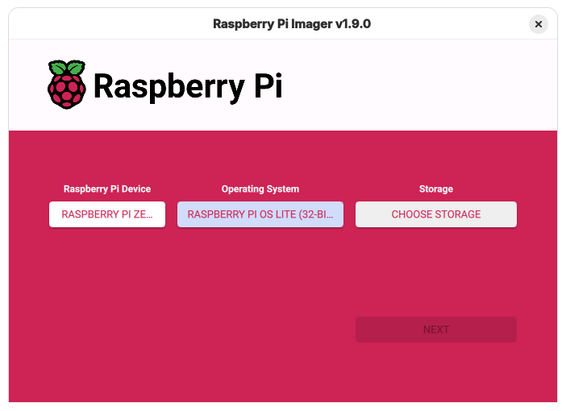
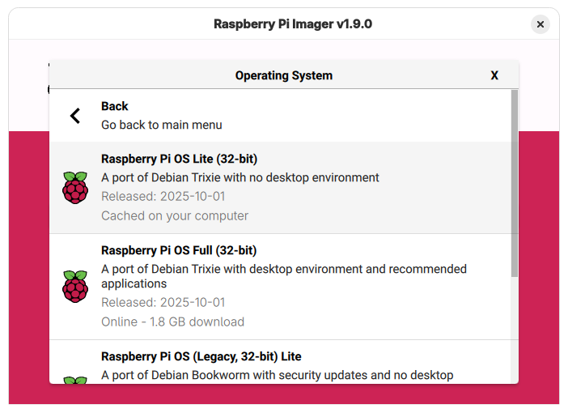
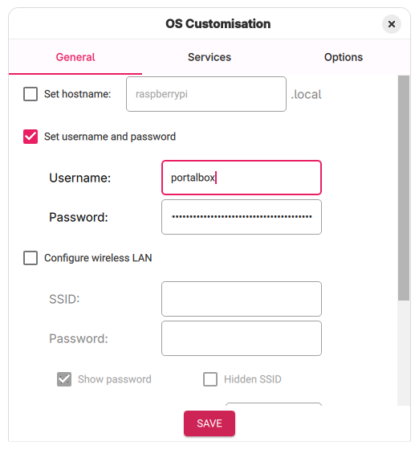
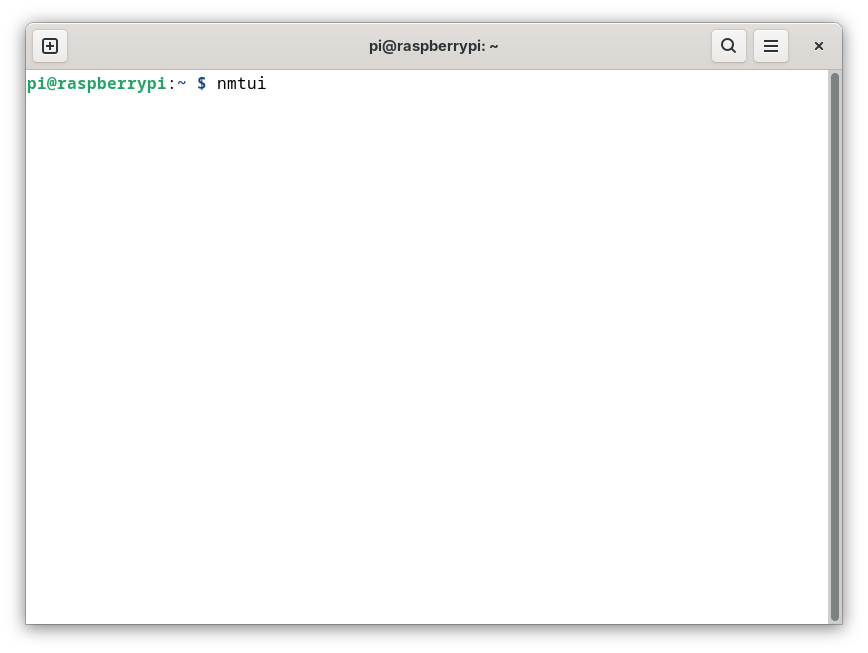
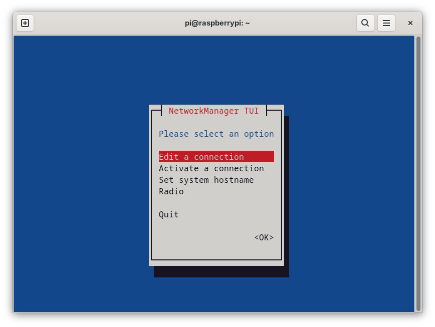
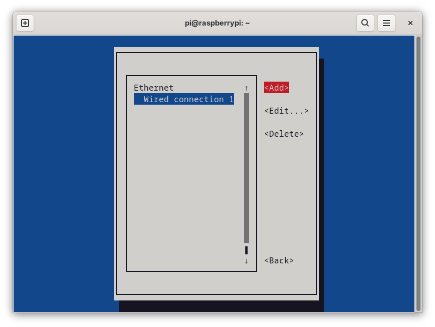
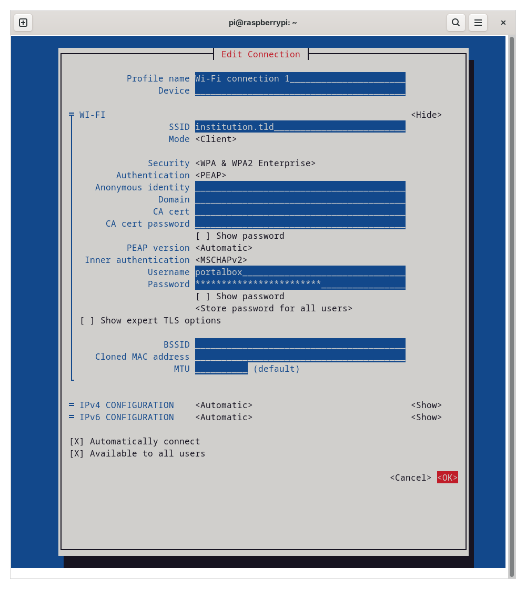

# Configure Raspbian

Raspbian is the Linux distribution which the Portalbox application is designed to run on. These instructions are written for Raspbian based on Debian 13 (Trixie).

## Image an SD Card

We have had a good experience imaging SD cards for our portalboxes using the [Raspberry Pi Imager](https://www.raspberrypi.com/software/).



We choose the "Lite" OS install because we do not normally connect a keyboard and mouse to our portalboxes. There is however nothing wrong with the default, desktop enabled versions.



We also customize the username and password of the default user.



If you are using wireless networking and you are not using WPA or WPA 2 with a pre-shared key (the common home and small business setup), we recommend you perform your wireless setup here as well.


## Configure Peripheral Access

Raspbian uses a safe, minimal configuration by default. This configuration does not enable UART, I2C, and SPI communications via the GPIO header block. As the portalbox hardware attaches devices expecting to communicate using these protocol we need to do a bit of configuration. If you are using a Linux PC to image your SD card you can make these changes once the SD card has been imaged. Otherwise you will need to insert your SD card into a Raspberry Pi, power it up and use the tools of your choice to edit the files on the `boot` partition as described in the following section relevant to your Raspberry Pi model.

### Configuration for Portalboxes Built Around a Raspberry Pi 0

In `/boot/firmware/cmdline.txt` remove:

```ini
console=serial0,115200
```

from the line. Then enable the i2c and spi interfaces by editing `/boot/firmware/config.txt` and change

```ini
#dtparam=i2c_arm=on
```

to:

```ini
dtparam=i2c_arm=on
```

and change:

```ini
#dtparam=spi=on
```

to:

```ini
dtparam=spi=on
```

and in the `All` section at the end of the file add the lines:

```ini
dtoverlay=spi0-hw-cs
enable_uart=1
```

### Configuration for Portalboxes Built Around a Raspberry Pi 4

In `/boot/firmware/config.txt` change

```ini
#dtparam=spi=on
```

to:

```ini
dtparam=spi=on
```

and in the `All` section at the end of the file add the lines:

```ini
enable_uart=1
dtoverlay=spi0-1cs
dtoverlay=spi1-1cs
dtoverlay=gpio-shutdown
dtoverlay=gpio-fan,gpio-pin=12,temp=55000
```

## Networking

The portalboxes need to communicate with the website in order to authorize usage. If you are using wired networking, raspbian should work with no additional configuration. If you are using home or small business Wi-Fi networking i.e. WPA/WPA2/WPA3 "Personal" or "Pre-shared key", we recommend that you use Raspberry Pi Imager to set your network configuration ([See above](#image-an-sd-card)). If you need to join the portalboxes to an institutional Wi-Fi i.e. WPA/WPA2 Enterprise, you will need to boot a Raspberry Pi connected to a keyboard and display and use the `nmtui` utility.



At the main `nmtui` menu you want to "Edit a connection"



You will be presented with a list of connections to edit.



Typically there will not be any connections in the list. If you see a wired connection like shown you can ignore it [we used a wired connection to collect our screenshots], though you should either use wired or wireless networking on a portalbox not both for best results. If you have existing wireless connections we recommend deleting them first then creating a new connection.

At a minimum you will need to enter the SSID a.k.a. the network name and choose "WPA & WPA2 Enterprise" for "Security". After that, institutions vary. We strongly recommend working with your institution's network administrators. Setting "Authentication" to "PEAP", "Inner authentication" to "MSCHAPv2" and entering a "Username" and "Password" as shown may or may not work for you.




## Install Software

Once the raspberry pi is online we can install the necessary software. We recommend installing any OS updates first using:

```sh
sudo apt update
sudo apt upgrade
```

at the command line. Then still at the command line install the software needed to get and run the portalbox service:

```sh
sudo apt install git python3-serial
```

finally give the raspberry pi a restart before installing the portalbox service with:

```sh
sudo shutdown -r now
```

